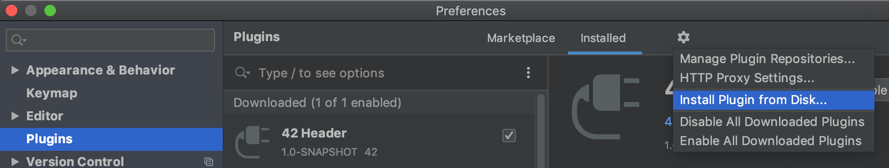
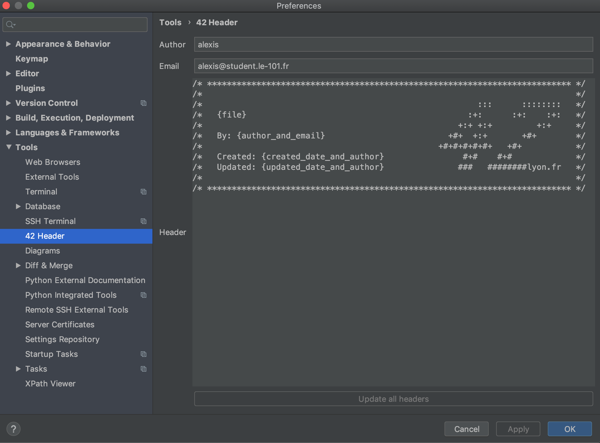

### 42 Header

To install this jetbrain plugin you have two ways:
1. Download the .jar from [this link](github.com/alexisvisco/42header) and go to `Preferences > Plugins` and

2. Search in the marketplace a plugin called 42 Header and install it.

#### How to add the header to a file

To add the header to a file use the keystroke alt + h.
This keystroke can be configured in `Preferences > Keymap > Plug-ins > 42 Header`

#### Configure the author, email and header

You can configure the header (since the default header is the header of 42lyon.fr), author and email in `Preferences > Tools > 42 Header`

If you are lazy once you modify something you can re-apply all headers to the files that have already an header by cling on the `Update all headers`

 
 

